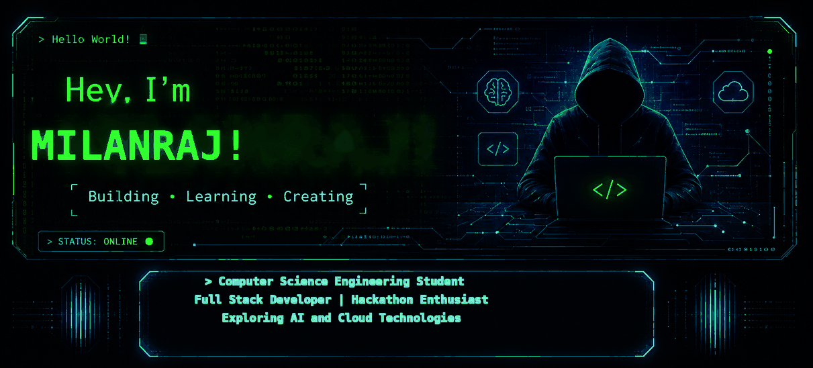
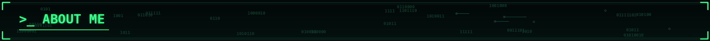
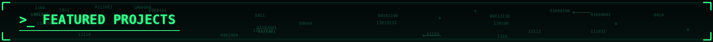
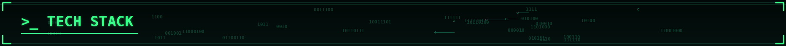
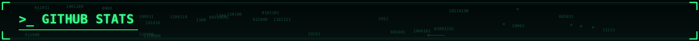
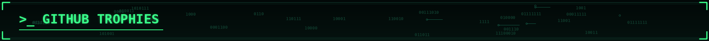
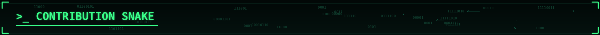
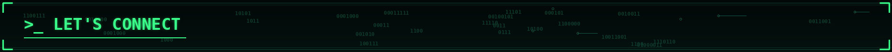
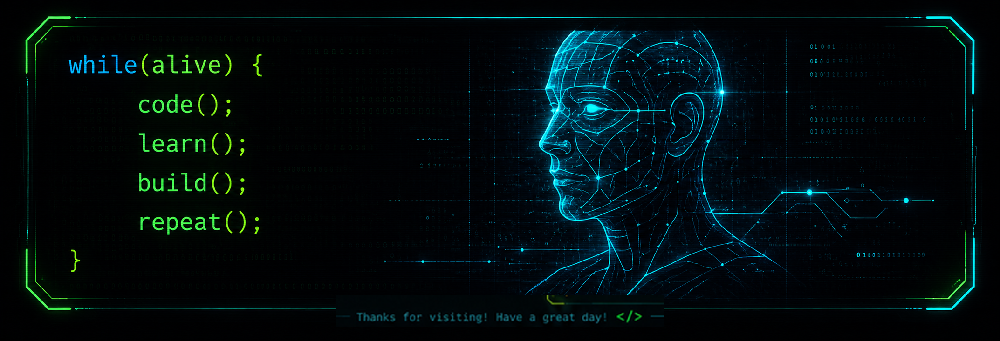

<div align="center">



</div>

<br>


<br><br>

- 🎓 3rd Year Computer Science Engineering Student
- 🚀 Currently building **EduSeatMap**, an Examination Seat Allotment System that automates seating arrangements, faculty allocation, and exam management.
- 🌱 Continuously learning and working with modern technologies, frameworks, databases, and tools.
- 🏆 Hackathon Enthusiast who enjoys solving real-world problems through technology.
- 🔭 Interested in Full-Stack Development, Artificial Intelligence, Cloud Computing, and Open Source.
- 📚 Always exploring new technologies and improving my development skills.

<br>


<br><br>

<table>
<tr>
<th>Project</th>
<th>Description</th>
<th>Tech Stack</th>
</tr>
<tr>
<td>🎓 <b>EduSeatMap</b></td>
<td>Smart Examination Seat Allotment System with automated seating, faculty allocation, and exam management.</td>
<td>


</td>
</tr>
<tr>
<td>✈️ <b>Airport Terminal Tracker</b></td>
<td>Airport information and tracking system with real-time data and smooth UI.</td>
<td>


</td>
</tr>
<tr>
<td>🧠 <b>AI Projects</b></td>
<td>AI/ML based experimental projects including computer vision and NLP.</td>
<td>


</td>
</tr>
</table>

<div align="right">
<a href="https://github.com/milanraj-github?tab=repositories">More projects on my GitHub repositories →</a>
</div>

<br>


<br><br>

**Languages**
<p>

</p>

**Frontend**
<p>

</p>

**Backend & Frameworks**
<p>

</p>

**Databases**
<p>

</p>

**AI & Data Science**
<p>


</p>

**Cloud & Tools**
<p>

</p>

<br>


<br><br>

<table>
<tr>
<td>

```
📦 Repos        : 55+
📝 Commits      : 500+
👥 Followers    : 50+
👀 Following    : 40+
```

</td>
<td></td>
<td></td>
</tr>
</table>

<p align="center">


</p>

<br>


<br><br>

<p align="center">

</p>

<br>


<br><br>

<p align="center">

</p>

> Keep contributing! Let's build an epic graph together.

<br>


<br><br>

<p align="center">
<a href="https://linkedin.com/in/your-linkedin-handle" target="_blank">

</a>
<a href="https://instagram.com/your-instagram-handle" target="_blank">

</a>
<a href="https://youtube.com/@your-youtube-handle" target="_blank">

</a>
<a href="mailto:your.email@example.com" target="_blank">

</a>
</p>

<br>

<div align="center">



</div>
